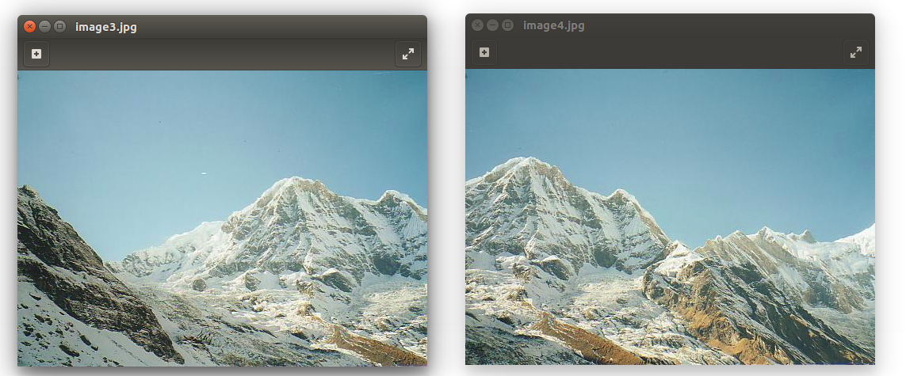
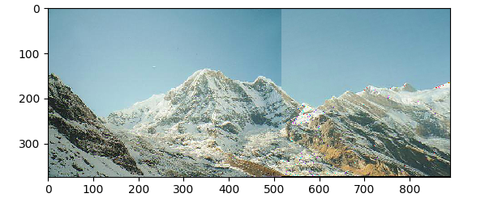
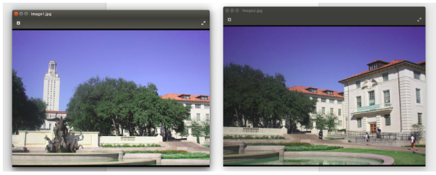
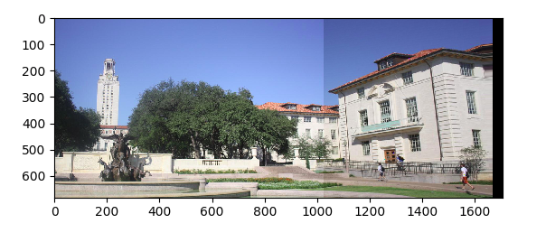

# Image_Mosaic
The project implements an image stitcher that uses image warping and homographies to automatically create an image mosaic without relying on OpenCv functions.

## Implementation details:
  1) Getting the correspondances either manually using Python ginput() or using OpenCv SIFT.

 2) findHomography() function is used to calculate the homography by solving a set of linear equations after obtaining 4 corresponding points.

 3) Use Ransac, if SIFT if used to obtain the best homography, that with acceptable number of inliers.

4) Use forward warping to get the bounding box of the src image into the destination frame.

5) Use Inverse warping to assign intenisties to each pixel within this bounding box and avoid holes in the warped image.

6) After obtaining the warped image, Stitch the two images together to from a Mosaic.

## Test cases:

### one:
#### Input

#### Output

### Two

#### Output

### PS:
 All functions are impelmented and OpenCv was only used to check our functions are behaving correctly, We conduct a comparison between our output and that of OpenCv.

 We have attached A report as well that explains the code and the assumptions we build the code upon in detail.
